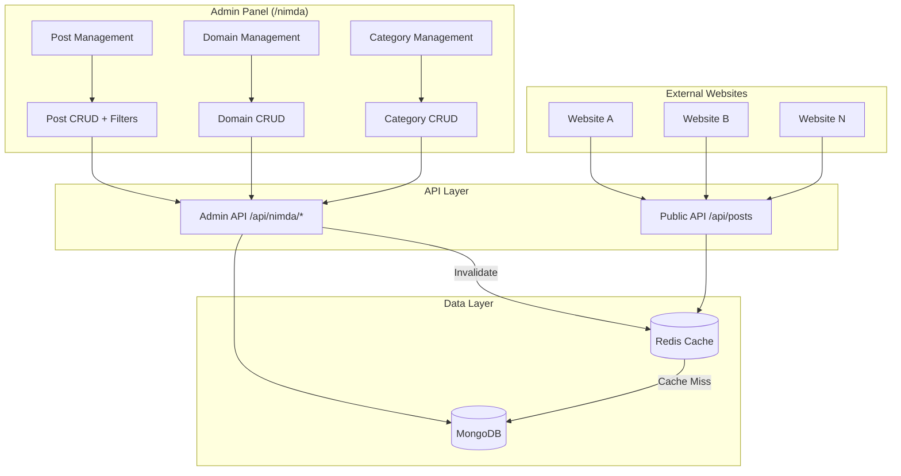
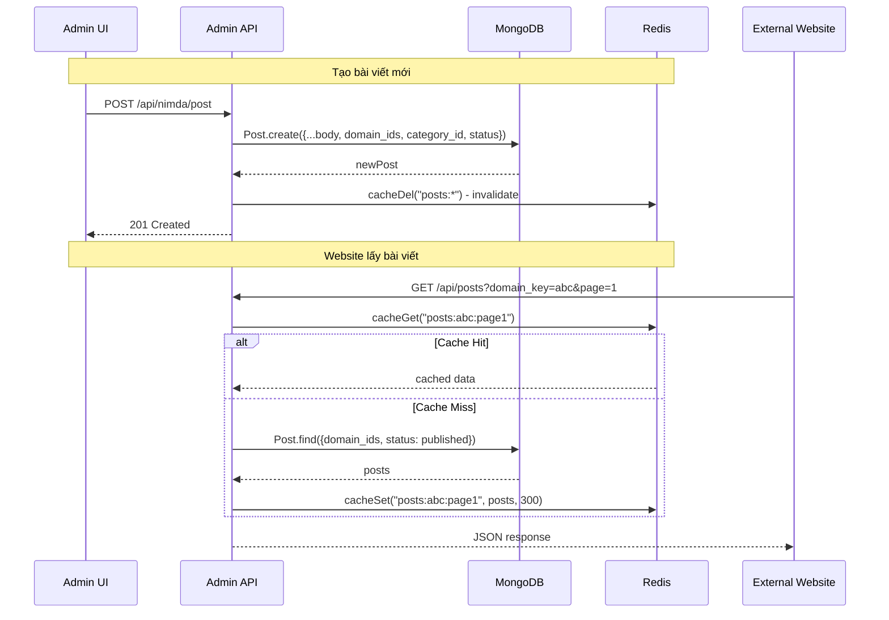
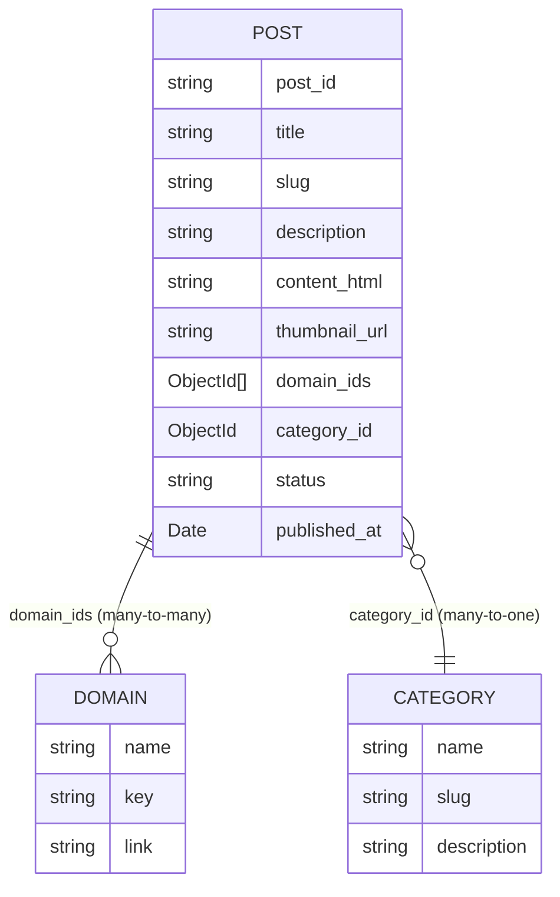

# Tài liệu Thiết kế - Hệ thống Quản lý Bài viết Đa Website

## Tổng quan

Tài liệu này mô tả thiết kế kỹ thuật cho hệ thống Quản lý Bài viết Đa Website (Multi-Site Post Management). Hệ thống mở rộng ứng dụng Next.js hiện có để cho phép quản trị viên tạo, chỉnh sửa, xóa và phân phối bài viết cho nhiều website khác nhau từ admin panel tại `/nimda`.

Các thay đổi chính:
- Mở rộng model `Post` hiện có: thêm `domain_ids`, `status`, `category_id`, `published_at`
- Tạo model `Category` mới cho phân loại bài viết
- Thêm CRUD quản lý Domain và Category trong admin panel
- Thêm bộ lọc/tìm kiếm bài viết theo website, danh mục, trạng thái
- Tạo API công khai (`/api/posts`) với Redis caching cho website bên ngoài
- Cập nhật form tạo/chỉnh sửa bài viết với các trường mới

## Kiến trúc

### Kiến trúc tổng thể



### Luồng dữ liệu

1. **Admin CRUD**: Admin panel → Admin API → MongoDB → Invalidate Redis cache
2. **Public API**: External website → Public API → Redis cache (hit) → Response
3. **Cache miss**: Public API → Redis cache (miss) → MongoDB → Set Redis cache → Response

### Quyết định thiết kế

- **Mở rộng model Post thay vì tạo mới**: Giữ backward compatibility, tận dụng code CRUD hiện có
- **`domain_ids` là mảng ObjectId**: Cho phép gán bài viết cho nhiều website (many-to-many)
- **`category_id` là single reference**: Mỗi bài viết thuộc một danh mục (hoặc null)
- **Redis cache chỉ cho Public API**: Admin luôn đọc trực tiếp từ MongoDB để đảm bảo dữ liệu mới nhất
- **Cache invalidation theo pattern**: Xóa tất cả cache key liên quan khi có thay đổi bài viết

## Thành phần và Giao diện

### 1. Models (Data Layer)

#### Post Model (mở rộng)
- File: `src/lib/models/post.ts`
- Thêm fields: `domain_ids`, `status`, `category_id`, `published_at`

#### Category Model (mới)
- File: `src/lib/models/category.ts`
- Fields: `name`, `slug`, `description`

#### Domain Model (giữ nguyên)
- File: `src/lib/models/domain.ts`
- Không thay đổi schema, chỉ thêm unique index cho `key`

### 2. API Routes

#### Admin API (mở rộng)

| Method | Route | Mô tả |
|--------|-------|-------|
| GET | `/api/nimda/post` | Lấy danh sách bài viết (có filter, pagination) |
| POST | `/api/nimda/post` | Tạo bài viết mới |
| PUT | `/api/nimda/post/[id]` | Cập nhật bài viết |
| DELETE | `/api/nimda/post/[id]` | Xóa bài viết |
| GET | `/api/nimda/domain` | Lấy danh sách domain |
| POST | `/api/nimda/domain` | Tạo domain mới |
| PUT | `/api/nimda/domain/[id]` | Cập nhật domain |
| DELETE | `/api/nimda/domain/[id]` | Xóa domain |
| GET | `/api/nimda/category` | Lấy danh sách category |
| POST | `/api/nimda/category` | Tạo category mới |
| PUT | `/api/nimda/category/[id]` | Cập nhật category |
| DELETE | `/api/nimda/category/[id]` | Xóa category |

#### Public API (mới)

| Method | Route | Mô tả |
|--------|-------|-------|
| GET | `/api/posts` | Lấy danh sách bài viết published (có filter, pagination, cached) |
| GET | `/api/posts/[slug]` | Lấy chi tiết bài viết theo slug (cached) |

### 3. UI Pages

#### Trang quản lý Domain (`/nimda/domain`)
- File: `src/app/(page)/nimda/domain/page.tsx`
- Bảng danh sách domain với nút tạo/sửa/xóa
- Form tạo/sửa domain inline hoặc dialog

#### Trang quản lý Category (`/nimda/category`)
- File: `src/app/(page)/nimda/category/page.tsx`  
- Bảng danh sách category với nút tạo/sửa/xóa
- Tự động sinh slug từ tên

#### Trang danh sách bài viết (mở rộng)
- File: `src/app/(page)/nimda/post/page.tsx`
- Thêm cột: danh mục, website (badges), trạng thái (badge màu), ngày tạo
- Thêm bộ lọc: dropdown domain, dropdown category, dropdown status, ô tìm kiếm

#### Form tạo/chỉnh sửa bài viết (mở rộng)
- Files: `src/app/(page)/nimda/post/create/page.tsx`, `src/app/(page)/nimda/post/edit/[id]/page.tsx`
- Thêm: dropdown chọn category, checkbox chọn domains, dropdown chọn status

### 4. Utility Functions

#### Cache Helpers (mở rộng)
- File: `src/utils/cache.ts`
- Thêm: `cacheDelPattern(pattern)` - xóa cache theo pattern cho invalidation

### Giao diện giữa các thành phần



## Mô hình Dữ liệu

### Post Schema (mở rộng)

```typescript
interface IPost extends Document {
    post_id: string           // ID ngắn duy nhất (giữ nguyên)
    title: string             // Tiêu đề (giữ nguyên)
    slug: string              // Slug URL (giữ nguyên)
    description: string       // Mô tả ngắn (giữ nguyên)
    content_html: string      // Nội dung HTML (giữ nguyên)
    thumbnail_url: string     // URL ảnh đại diện (giữ nguyên)
    // --- Trường mới ---
    domain_ids: ObjectId[]    // Mảng ID các Domain được gán
    category_id: ObjectId | null  // ID danh mục (nullable)
    status: 'draft' | 'published' // Trạng thái bài viết
    published_at: Date | null     // Thời gian xuất bản
    // --- Timestamps ---
    createdAt: Date
    updatedAt: Date
}
```

Mongoose Schema mở rộng:
```typescript
// Thêm vào PostSchema
domain_ids: [{
    type: Schema.Types.ObjectId,
    ref: 'Domain'
}],
category_id: {
    type: Schema.Types.ObjectId,
    ref: 'Category',
    default: null
},
status: {
    type: String,
    enum: ['draft', 'published'],
    default: 'draft'
},
published_at: {
    type: Date,
    default: null
}
```

### Category Schema (mới)

```typescript
interface ICategory extends Document {
    name: string          // Tên danh mục
    slug: string          // Slug URL (unique)
    description: string   // Mô tả
    createdAt: Date
    updatedAt: Date
}

const CategorySchema = new Schema({
    name: { type: String, required: true, trim: true },
    slug: { type: String, required: true, unique: true, trim: true },
    description: { type: String, default: '', trim: true }
}, { timestamps: true })
```

### Domain Schema (cập nhật index)

```typescript
// Thêm unique index cho key
DomainSchema.index({ key: 1 }, { unique: true })
```

### Quan hệ giữa các Model



### Redis Cache Keys

| Key Pattern | Dữ liệu | TTL |
|-------------|----------|-----|
| `posts:list:{domain_key}:{category_slug}:{page}:{limit}` | Danh sách bài viết published | 5 phút (300s) |
| `posts:detail:{slug}` | Chi tiết bài viết | 5 phút (300s) |

Khi admin tạo/sửa/xóa bài viết → xóa tất cả key bắt đầu bằng `posts:`.

### API Request/Response

#### GET /api/posts (Public)

Query params:
- `domain_key` (optional): Lọc theo domain key
- `category_slug` (optional): Lọc theo category slug
- `page` (optional, default: 1): Trang hiện tại
- `limit` (optional, default: 10): Số bài viết mỗi trang
- `slug` (optional): Lấy chi tiết bài viết theo slug

Response (danh sách):
```json
{
    "data": [
        {
            "post_id": "abc123",
            "title": "Tiêu đề bài viết",
            "slug": "tieu-de-bai-viet",
            "description": "Mô tả ngắn",
            "content_html": "<p>...</p>",
            "thumbnail_url": "/uploads/image.webp",
            "category": { "name": "Tin tức", "slug": "tin-tuc" },
            "domains": [{ "name": "Website A", "key": "site-a" }],
            "status": "published",
            "published_at": "2024-01-01T00:00:00Z",
            "createdAt": "2024-01-01T00:00:00Z"
        }
    ],
    "page": 1,
    "limit": 10,
    "total": 50,
    "totalPages": 5
}
```

#### GET /api/posts/[slug] (Public)

Response:
```json
{
    "post_id": "abc123",
    "title": "Tiêu đề bài viết",
    "slug": "tieu-de-bai-viet",
    "description": "Mô tả ngắn",
    "content_html": "<p>Nội dung đầy đủ...</p>",
    "thumbnail_url": "/uploads/image.webp",
    "category": { "name": "Tin tức", "slug": "tin-tuc" },
    "domains": [{ "name": "Website A", "key": "site-a" }],
    "status": "published",
    "published_at": "2024-01-01T00:00:00Z",
    "createdAt": "2024-01-01T00:00:00Z"
}
```

#### GET /api/nimda/post (Admin - mở rộng)

Query params:
- `page`, `limit`: Phân trang
- `domain_id` (optional): Lọc theo domain ID
- `category_id` (optional): Lọc theo category ID
- `status` (optional): Lọc theo trạng thái
- `search` (optional): Tìm kiếm theo tiêu đề

Response: Tương tự public API nhưng bao gồm cả bài viết draft.


## Thuộc tính Đúng đắn (Correctness Properties)

*Thuộc tính đúng đắn là một đặc điểm hoặc hành vi phải luôn đúng trong mọi lần thực thi hợp lệ của hệ thống — về cơ bản là một phát biểu hình thức về những gì hệ thống phải làm. Các thuộc tính đóng vai trò cầu nối giữa đặc tả dễ đọc cho con người và đảm bảo tính đúng đắn có thể kiểm chứng bằng máy.*

### Property 1: Domain CRUD round-trip

*For any* valid domain data (name, key, link), creating a domain and then reading it back should return a domain with the same name, key, and link values.

**Validates: Requirements 1.2, 1.3**

### Property 2: Domain key uniqueness

*For any* two domain creation requests with the same `key` value, the second request should be rejected with an error, and the database should contain exactly one domain with that key.

**Validates: Requirements 1.5, 1.6**

### Property 3: Domain deletion removes domain

*For any* existing domain, after deletion, querying for that domain by ID should return no result.

**Validates: Requirements 1.4**

### Property 4: Post references round-trip

*For any* valid post with a list of `domain_ids` and a `category_id`, saving the post and reading it back should preserve the exact same `domain_ids` array and `category_id` value.

**Validates: Requirements 2.1, 4.5**

### Property 5: New post defaults to draft status

*For any* newly created post where status is not explicitly set, the post's `status` field should be `'draft'` and `published_at` should be `null`.

**Validates: Requirements 3.2**

### Property 6: Publishing sets published_at timestamp

*For any* post with status `'draft'`, when the status is changed to `'published'`, the `published_at` field should be set to a non-null Date value.

**Validates: Requirements 3.3**

### Property 7: Unpublishing preserves published_at

*For any* post with status `'published'` and a non-null `published_at` value, when the status is changed back to `'draft'`, the `published_at` field should retain its previous value.

**Validates: Requirements 3.4**

### Property 8: Category slug generation from name

*For any* valid category name, creating a category should produce a slug that is a non-empty, URL-safe string (lowercase, no special characters except hyphens) derived from the name.

**Validates: Requirements 4.2**

### Property 9: Category slug uniqueness

*For any* two categories created with the same name, the system should assign unique slugs (e.g., by appending an incrementing suffix to the second).

**Validates: Requirements 4.3**

### Property 10: Category deletion nullifies post references

*For any* category that is referenced by one or more posts via `category_id`, after deleting that category, all those posts should have `category_id` set to `null`.

**Validates: Requirements 4.6**

### Property 11: Filter results satisfy all conditions

*For any* combination of filters (domain_id, category_id, status, search keyword), every post in the result set should satisfy ALL specified filter conditions simultaneously (AND logic).

**Validates: Requirements 5.1, 5.2, 5.3, 5.4, 5.5**

### Property 12: Pagination invariants

*For any* paginated query with parameters `page` and `limit`, the number of returned items should be at most `limit`, and the `totalPages` value should equal `ceil(total / limit)`.

**Validates: Requirements 5.6, 6.4, 8.3**

### Property 13: Public API returns only published posts

*For any* request to the public API `/api/posts` with any combination of filters, every post in the result set should have `status === 'published'`.

**Validates: Requirements 6.1, 6.2, 6.3**

### Property 14: Public API detail returns published only

*For any* post slug, the public API `/api/posts/[slug]` should return the post only if its status is `'published'`; otherwise it should return 404.

**Validates: Requirements 6.5**

### Property 15: Cache is populated after public API request

*For any* public API request, after the first request completes, the corresponding Redis cache key should contain the same data as the response.

**Validates: Requirements 6.6**

### Property 16: Cache invalidation on post mutation

*For any* post create, update, or delete operation via the admin API, all Redis cache keys matching the `posts:*` pattern should be deleted.

**Validates: Requirements 6.7**

### Property 17: Post slug uniqueness with suffix

*For any* set of posts created with the same title, each post should receive a unique slug, with subsequent posts getting an incrementing numeric suffix (e.g., `slug`, `slug-2`, `slug-3`).

**Validates: Requirements 7.2, 7.3**

### Property 18: Required field validation

*For any* post creation request missing one or more required fields (title, description, content_html), the API should return a 400 error with a message identifying the missing field(s).

**Validates: Requirements 7.4**

### Property 19: Default sort order is newest first

*For any* list of posts returned by the admin API without explicit sort parameters, the posts should be ordered by `createdAt` in descending order (newest first).

**Validates: Requirements 8.2**

## Xử lý Lỗi

### Lỗi Validation

| Trường hợp | HTTP Status | Response |
|-------------|-------------|----------|
| Thiếu trường bắt buộc (title, description, content_html) | 400 | `{ message: "Validation Error", errors: { field: "message" } }` |
| Domain key đã tồn tại | 409 | `{ message: "Key đã tồn tại" }` |
| Category slug đã tồn tại | 409 | `{ message: "Slug đã tồn tại" }` |
| Invalid ObjectId | 400 | `{ message: "Invalid ID" }` |
| Status không hợp lệ (không phải draft/published) | 400 | `{ message: "Status không hợp lệ" }` |

### Lỗi Not Found

| Trường hợp | HTTP Status | Response |
|-------------|-------------|----------|
| Post không tồn tại | 404 | `{ message: "Bài viết không tìm thấy" }` |
| Domain không tồn tại | 404 | `{ message: "Website không tìm thấy" }` |
| Category không tồn tại | 404 | `{ message: "Danh mục không tìm thấy" }` |
| Public API slug không tồn tại hoặc draft | 404 | `{ message: "Bài viết không tìm thấy" }` |

### Lỗi Server

| Trường hợp | HTTP Status | Response |
|-------------|-------------|----------|
| MongoDB connection failure | 500 | `{ message: "Lỗi kết nối cơ sở dữ liệu" }` |
| Redis connection failure | Fallback to DB | Log error, bypass cache, query DB trực tiếp |
| File upload failure | 500 | `{ message: "Upload file thất bại" }` |

### Chiến lược xử lý lỗi

- **Redis failure**: Graceful degradation — nếu Redis không khả dụng, public API sẽ query trực tiếp MongoDB (không cache)
- **Cascade delete**: Khi xóa Category, cập nhật `category_id = null` cho tất cả Post liên quan trước khi xóa
- **Cascade delete Domain**: Khi xóa Domain, xóa domain ID khỏi `domain_ids` array của tất cả Post liên quan

## Chiến lược Kiểm thử

### Phương pháp kiểm thử kép

Hệ thống sử dụng kết hợp **unit tests** và **property-based tests** để đảm bảo tính đúng đắn toàn diện.

### Unit Tests

Unit tests tập trung vào các trường hợp cụ thể, edge cases, và error conditions:

- **Model validation**: Kiểm tra schema validation cho Post, Category, Domain
- **Slug generation**: Kiểm tra `generateSlug()` với các input cụ thể (tiếng Việt, ký tự đặc biệt, chuỗi rỗng)
- **API error responses**: Kiểm tra các trường hợp lỗi cụ thể (missing fields, duplicate keys, invalid IDs)
- **Cache helpers**: Kiểm tra `cacheGet`, `cacheSet`, `cacheDel` với các giá trị cụ thể
- **Status transitions**: Kiểm tra edge case khi published_at đã có giá trị
- **Image upload**: Kiểm tra WebP conversion với file cụ thể

### Property-Based Tests

Property-based tests sử dụng thư viện **fast-check** (`npm install --save-dev fast-check`) để kiểm tra các thuộc tính đúng đắn trên nhiều input ngẫu nhiên.

**Cấu hình**:
- Mỗi property test chạy tối thiểu **100 iterations**
- Mỗi test phải có comment tham chiếu đến property trong design document
- Format tag: **Feature: multi-site-post-management, Property {number}: {property_text}**

**Danh sách property tests**:

1. **Domain CRUD round-trip** (Property 1) — Tạo domain với dữ liệu ngẫu nhiên, đọc lại, so sánh
2. **Domain key uniqueness** (Property 2) — Tạo 2 domain cùng key, verify lỗi
3. **Post references round-trip** (Property 4) — Tạo post với domain_ids/category_id ngẫu nhiên, đọc lại
4. **New post defaults to draft** (Property 5) — Tạo post không set status, verify draft
5. **Publishing sets published_at** (Property 6) — Chuyển draft→published, verify published_at
6. **Unpublishing preserves published_at** (Property 7) — Chuyển published→draft, verify published_at giữ nguyên
7. **Category slug generation** (Property 8) — Tạo category với tên ngẫu nhiên, verify slug hợp lệ
8. **Category slug uniqueness** (Property 9) — Tạo 2 category cùng tên, verify slug khác nhau
9. **Category deletion nullifies references** (Property 10) — Xóa category, verify posts.category_id = null
10. **Filter results satisfy all conditions** (Property 11) — Tạo posts ngẫu nhiên, áp dụng filter, verify kết quả
11. **Pagination invariants** (Property 12) — Query với page/limit ngẫu nhiên, verify bounds
12. **Public API returns only published** (Property 13) — Tạo mix draft/published, verify public API
13. **Cache populated after request** (Property 15) — Request public API, verify Redis cache
14. **Cache invalidation on mutation** (Property 16) — Populate cache, mutate post, verify cache cleared
15. **Post slug uniqueness** (Property 17) — Tạo nhiều post cùng title, verify slug unique
16. **Required field validation** (Property 18) — Gửi request thiếu field ngẫu nhiên, verify error
17. **Default sort order** (Property 19) — Tạo posts, verify sort descending by createdAt

Mỗi property test PHẢI được implement bằng MỘT test duy nhất sử dụng `fast-check`, với comment tag theo format:
```typescript
// Feature: multi-site-post-management, Property 1: Domain CRUD round-trip
```
